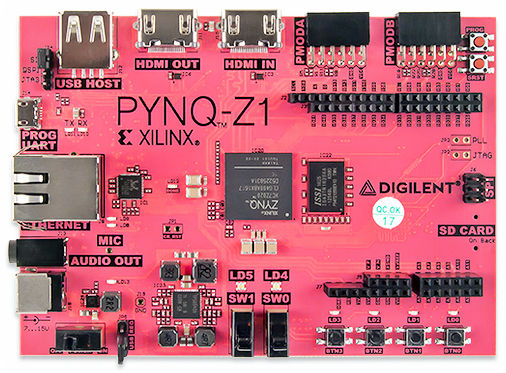

.. Pynquino documentation master file, created by
   sphinx-quickstart on Sun Jun 17 13:19:24 2018.
   You can adapt this file completely to your liking, but it should at least
   contain the root `toctree` directive.

=====================
Pynquinoとは
=====================

ArduinoをXilinxのFPGA(PYNQ)と連携させるプロジェクトです。(Pynquino= **PYNQ** +Ard **uino** )

.. toctree::
  :hidden:

  .. getting_started
  .. blockly
  .. developers
  .. showcases
  .. development_plan

---------------------
PYNQとArduinoのスムーズな連携
---------------------

Xilinxの `PYNQプラットフォーム <http://www.pynq.io/>`_ では、Pythonを用いてFPGAのアプリケーションを開発できるため、ソフトウェアエンジニアもFPGAを用いた機械学習や画像処理などのアプリケーション開発に取り組むことができます。

PYNQの基板にはArduinoシールドが装着できるようになっていますが、Arduinoスケッチをそのまま実行することはできません。ArduinoスケッチをPYNQが使用しているソフトプロセッサ（MicroBlaze）向けに変更する必要があります。

Pynquinoプロジェクトでは、ArdunoスケッチをPYNQ上で実行可能にすることで、マイコンでのリアルタイム処理とFPGA上での高速な処理の両方を組み合わせたアプリケーションの開発を可能にすることを目指します。

---------------------
デモプロジェクト
---------------------
現在、RepRapベースの3Dプリンタに画像処理機能を追加するためのデモプロジェクトを開発しています。

* `ファームウェア <https://github.com/shohei/zsprinter-pynquino>`_
* `シールド基板 <https://github.com/shohei/3dp-shield-rev3>`_

詳細については本サイトに追記する予定です。

